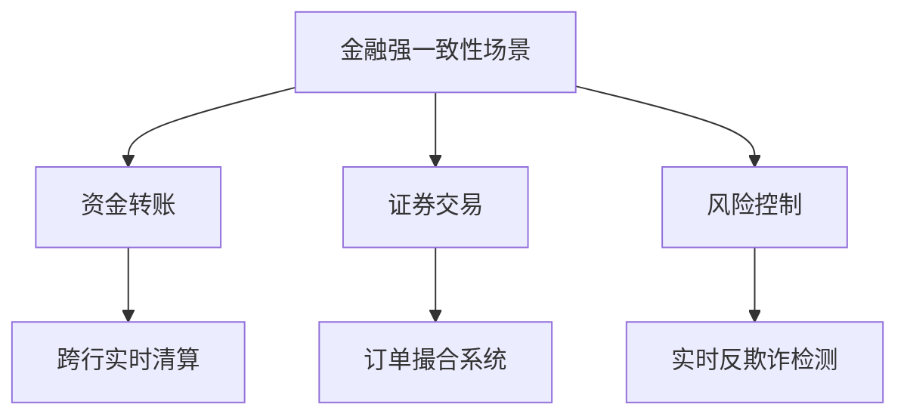
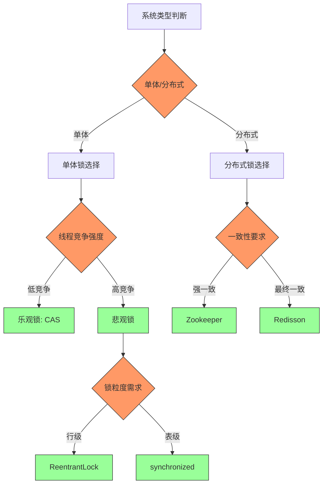
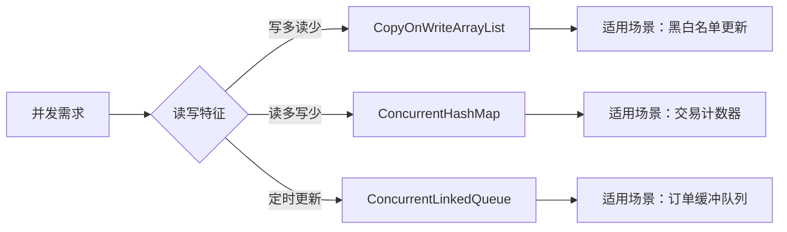
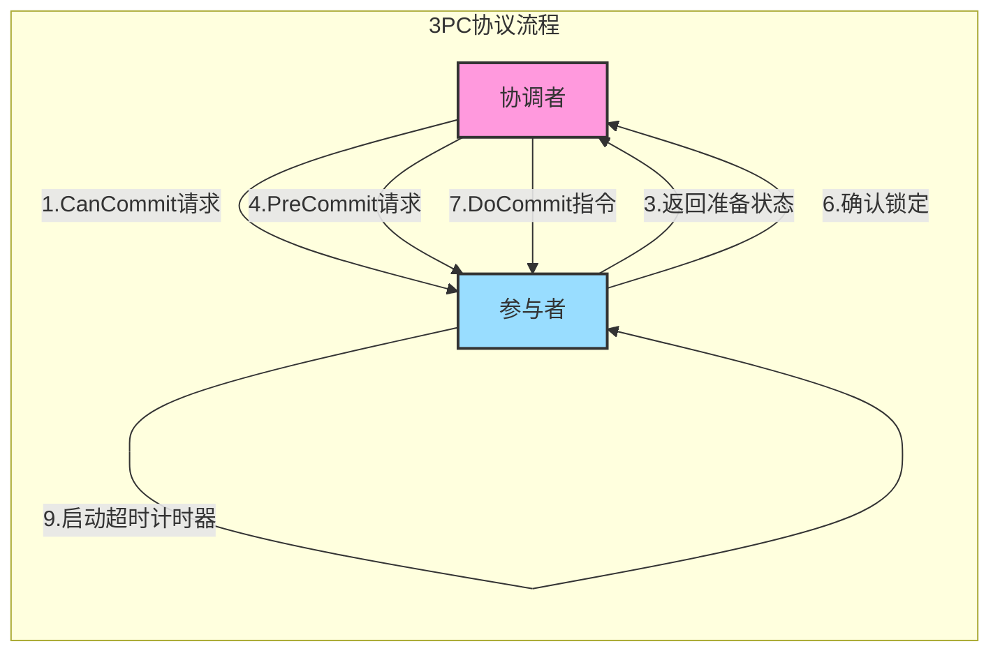
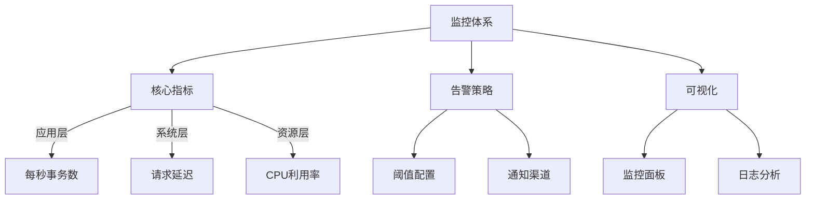

# 金融领域强一致性决策指南
## 一、核心概念体系
### 1.1 强一致性定义
- **核心要求**：分布式系统中所有节点在任何时刻读取同一数据的结果完全一致
- **关键特征**：
  - 数据原子性保证（ACID特性）
  - 全局操作顺序性（Linearizability）
  - 实时可见性（无延迟传播）
  - 故障容错能力（Paxos/Raft）

### 1.2 典型金融场景


## 二、技术决策矩阵
### 2.1 强一致性必要条件
| 判断维度       | 技术标准                                                                 | 典型场景                     |
|----------------|--------------------------------------------------------------------------|----------------------------|
| 资金安全性     | 100%原子性完成，行级锁/SELECT FOR UPDATE                                | 跨境支付、高频交易          |
| 实时性约束     | 全局实时可见，事务隔离级别≥REPEATABLE READ                              | 账户余额更新、持仓同步      |
| 监管合规       | 支持事务日志追溯，XA协议保障                                            | 交易结算、资本充足率计算    |
| 数据关联性     | 跨资源协调，TCC/2PC协议保障                                             | 复合金融产品、数字货币交易  |

### 2.2 最终一致性适用场景
| 判断维度       | 技术标准                                                                 | 典型场景                     |
|----------------|--------------------------------------------------------------------------|----------------------------|
| 非核心业务     | 延迟≤1秒，Redis延迟双删策略                                             | 登录统计、积分发放          |
| 数据可修复性   | T+1对账+Saga模式补偿                                                    | 手续费计算、收益结转        |
| 高并发写入     | QPS>10k时采用Kafka异步削峰                                              | 行情缓存、流水批量入库      |
| 跨系统协同     | 定义状态机+超时补偿机制                                                 | 跨境汇款、保险理赔          |

## 三、锁机制决策树


## 四、Java并发工具对比
### 4.1 锁机制对比表
| 锁类型               | 适用场景                  | 性能指标(TPS) | 代码示例                                                                 |
|----------------------|-------------------------|---------------|--------------------------------------------------------------------------|
| ReentrantLock        | 账户余额更新            | 8,500         | [分段锁示例](#)                                                         |
| StampedLock          | 行情数据读取            | 12,000        | [乐观读示例](#)                                                         |
| ReadWriteLock        | 配置信息缓存            | 6,200         | ```rwLock.readLock().lock();```                                         |
| Synchronized         | 简单计数器              | 5,000         | ```synchronized void increment() { ... }```                             |

### 4.2 并发容器选型


## 五、分布式事务实现
### 5.1 2PC协议实现要点
```java
// 账户服务参与者
public class AccountService implements Participant {
    private Map<String, Account> accounts = new ConcurrentHashMap<>();
    private Map<String, AccountState> txLog = new ConcurrentHashMap<>();

    @Override
    public boolean prepare(String txId) {
        Account account = accounts.get("A");
        synchronized(account) {
            if(account.balance < 100) return false;
            txLog.put(txId, account.snapshot());
            account.balance -= 100; // 预扣款
            return true;
        }
    }
    
    @Override
    public void commit(String txId) {
        txLog.remove(txId); // 持久化确认
    }
}
```

### 5.2 3PC优化方案


## 六、性能优化实践
### 6.1 分段锁实现方案
```java
public class ShardedAccountService {
    private final ReentrantLock[] locks = new ReentrantLock[16];
    
    public void transfer(String from, String to) {
        int fromShard = from.hashCode() % 16;
        int toShard = to.hashCode() % 16;
        
        if(fromShard < toShard) {
            locks[fromShard].lock();
            locks[toShard].lock();
        } else {
            locks[toShard].lock();
            locks[fromShard].lock();
        }
        
        try {
            // 执行转账逻辑
        } finally {
            locks[fromShard].unlock();
            locks[toShard].unlock();
        }
    }
}
```

### 6.2 高并发计数器
```java
public class TradeCounter {
    private final ConcurrentHashMap<String, LongAdder> counters = new ConcurrentHashMap<>();
    
    public void increment(String stock) {
        counters.computeIfAbsent(stock, k -> new LongAdder()).increment();
    }
    
    public long getCount(String stock) {
        return counters.getOrDefault(stock, new LongAdder()).sum();
    }
}
```

## 七、容错与监控
### 7.1 异常处理策略
| 异常类型         | 处理方案                          | 恢复机制                 |
|------------------|-----------------------------------|--------------------------|
| 网络分区         | 熔断降级 + 异步重试               | 自动补偿事务            |
| 节点故障         | 主从切换 + 状态同步               | Raft日志恢复            |
| 数据不一致       | 实时对账 + 差异修复               | 定时校对任务            |

### 7.2 监控指标配置


本指南通过结构化知识体系、可视化决策流程和实战代码示例，构建了覆盖金融级一致性要求的完整技术方案，可作为分布式系统设计的核心参考依据。
