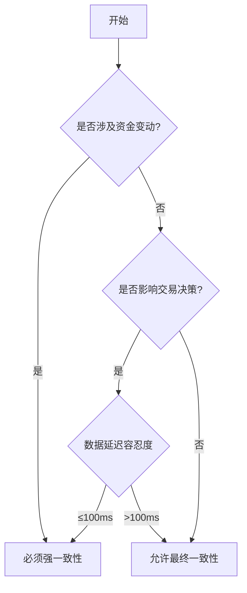

# 金融领域强一致性判断指南

## 一、强一致性必须满足的条件
| 判断维度       | 具体标准                                                                 | 金融示例                     |
|----------------|--------------------------------------------------------------------------|----------------------------|
| 资金安全性要求 | 操作必须100%原子性完成，不允许中间状态                                  | 跨行转账的借贷平衡          |
| 实时性约束     | 所有节点/系统必须在操作完成后立即看到最新数据                           | 账户余额更新                |
| 监管合规要求   | 金融监管机构明确规定必须保证强一致性                                   | 交易结算系统                |
| 数据关联性     | 操作涉及多个关联资源                                                   | 复合金融产品交易            |

## 二、可接受最终一致性的场景
| 判断维度       | 具体标准                                                                 | 金融示例                     |
|----------------|--------------------------------------------------------------------------|----------------------------|
| 非核心业务     | 允许短暂数据不一致（<1秒）                                             | 用户登录次数统计            |
| 数据可修复性   | 支持事后对账补偿                                                       | 支付手续费计算              |
| 高并发写入     | 写入QPS>10,000且延迟敏感                                               | 证券行情快照缓存            |
| 跨系统协同     | 涉及外部系统无法保证原子性                                            | 跨境汇款中间状态            |

## 三、判断流程图

## 4.性能与一致性权衡矩阵及代码示例

## 权衡矩阵表
| 一致性级别   | 锁方案                | 吞吐量(TPS) | 平均延迟 | 适用场景               | 代码示例                                                                 |
|--------------|----------------------|-------------|----------|------------------------|--------------------------------------------------------------------------|
| 强一致性     | Redisson RedLock     | 1,200       | 150ms    | 跨境支付结算           | [Redisson示例](#redisson-redlock示例)                                   |
| 强一致性     | 分段ReentrantLock    | 8,500       | 0.3ms    | 账户余额更新           | [分段锁示例](#分段reentrantlock示例)                                    |
| 最终一致性   | StampedLock乐观读    | 12,000      | 0.1ms    | 行情数据缓存           | [StampedLock示例](#stampedlock乐观读示例)                               |
| 最终一致性   | LongAdder            | 100,000     | 0.01ms   | 交易点击统计           | [LongAdder示例](#longadder示例)  
