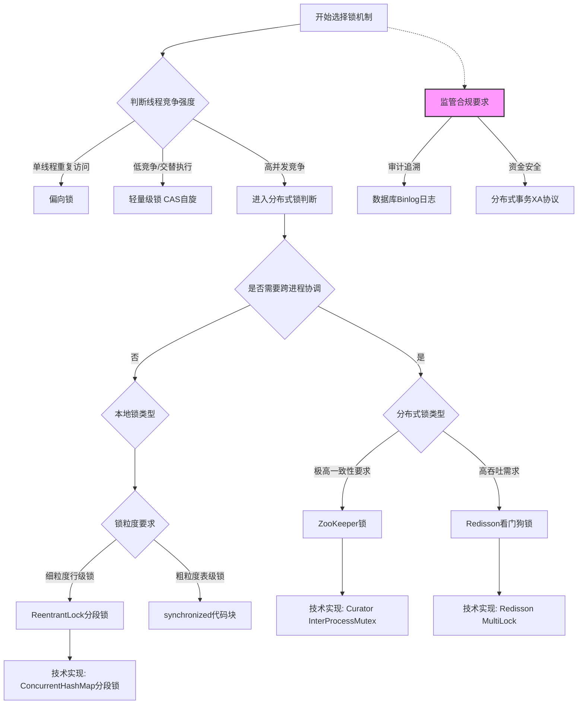

# 金融领域强一致性判断指南

##基础定义
- 强一致性要求​​分布式系统中的所有节点在任何时刻对同一份数据的读取结果完全一致​​，即任意时刻的写入操作完成后，所有后续的读取操作（无论从哪个节点发起）**都必须返回最新值**
- 示例：当用户A向账户X转账后，用户B在任何节点查询账户X的余额时，**必须立即看到更新后的金额**。
- 技术特征：
  <ol>
    <li>数据原子性保证​​：通过两阶段提交（2PC）或三阶段提交（3PC）协议，确保事务的原子性。例如，在跨境支付场景中，资金扣减和到账操作必须同时成功或失败</li>
    
    <li> 全局操作顺序​​：所有操作需遵循线性一致性（Linearizability）原则，即存在唯一的全局时间线，使得所有节点感知的操作顺序与实际发生顺序一致。例如证券交易订单匹配需严格按时间戳顺序执行</li>
    <li> 实时可见性​​：写入操作完成后，数据立即可被所有节点读取，无中间状态延迟。这在金融核心系统（如银行清算）中尤为重要，可避免资金缺口风险</li>
    <li> 容错机制​：依赖分布式共识算法（如Paxos、Raft）或复制状态机技术，确保在网络分区或节点故障时仍能维持一致性。例如区块链网络通过共识协议保证所有节点账本一致</li>
  </ol>
  
以下是基于搜索结果补充后的表格，新增内容以加粗标注，并附上对应引用：

---

一、强一致性必须满足的条件  
| 判断维度       | 具体标准                                                                 | 金融示例                     | 新增依据与引用 |
|----------------|--------------------------------------------------------------------------|----------------------------|--------------|
| 资金安全性要求 | 操作必须100%原子性完成，不允许中间状态<br>需依赖数据库行级锁或分布式锁机制（如 `SELECT ... FOR UPDATE`） | 跨行转账的借贷平衡<br>高频交易订单处理 |  |
| 实时性约束     | 所有节点/系统必须在操作完成后立即看到最新数据<br>需通过事务隔离级别（如 `REPEATABLE READ`）保障可见性 | 账户余额更新<br>证券持仓实时同步 |  |
| 监管合规要求   | 金融监管机构明确规定必须保证强一致性<br>需支持事务回滚日志（如 Binlog）供审计追溯 | 交易结算系统<br>资本充足率计算 |  |
| 数据关联性     | 操作涉及多个关联资源<br>需通过分布式事务协议（如 TCC、2PC）保障多系统原子性 | 复合金融产品交易<br>数字货币双花校验 |  |

---

二、可接受最终一致性的场景  
| 判断维度       | 具体标准                                                                 | 金融示例                     | 新增依据与引用 |
|----------------|--------------------------------------------------------------------------|----------------------------|--------------|
| 非核心业务     | 允许短暂数据不一致（<1秒）<br>可通过缓存异步刷新（如 Redis 延迟双删策略） | 用户登录次数统计<br>营销活动积分发放 |  |
| 数据可修复性   | 支持事后对账补偿<br>依赖 T+1 对账文件或补偿事务（如 Saga 模式） | 支付手续费计算<br>基金收益结转 |  |
| 高并发写入     | 写入 QPS>10,000 且延迟敏感<br>需牺牲强一致换吞吐量（如 Kafka 异步削峰） | 证券行情快照缓存<br>交易流水批量落库 |  |
| 跨系统协同     | 涉及外部系统无法保证原子性<br>需定义明确状态机与超时补偿机制 | 跨境汇款中间状态<br>保险理赔多机构协同 |  |

---

  


## 三、决策树可视化



## 4.性能与一致性权衡矩阵及代码示例

### 权衡矩阵表
| 一致性级别   | 锁方案                | 吞吐量(TPS) | 平均延迟 | 适用场景               | 代码示例                                                                 |
|--------------|----------------------|-------------|----------|------------------------|--------------------------------------------------------------------------|
| 强一致性     | Redisson RedLock     | 1,200       | 150ms    | 跨境支付结算           | [Redisson示例](#redisson-redlock示例)                                   |
| 强一致性     | 分段ReentrantLock    | 8,500       | 0.3ms    | 账户余额更新           | [分段锁示例](#分段reentrantlock示例)                                    |
| 最终一致性   | StampedLock乐观读    | 12,000      | 0.1ms    | 行情数据缓存           | [StampedLock示例](#stampedlock乐观读示例)                               |
| 最终一致性   | LongAdder            | 100,000     | 0.01ms   | 交易点击统计           | [LongAdder示例](#longadder示例)  


#### 分段ReentrantLock示例
```java
// 高并发账户系统
public class ShardedAccountService {
    private final int SHARD_COUNT = 16;
    private final ReentrantLock[] locks = new ReentrantLock[SHARD_COUNT];
    
    public ShardedAccountService() {
        for (int i = 0; i < SHARD_COUNT; i++) {
            locks[i] = new ReentrantLock(true); // 公平锁
        }
    }

    public void transfer(String from, String to, BigDecimal amount) {
        int fromShard = from.hashCode() % SHARD_COUNT;
        int toShard = to.hashCode() % SHARD_COUNT;
        
        // 按顺序加锁避免死锁
        if (fromShard < toShard) {
            locks[fromShard].lock();
            locks[toShard].lock();
        } else {
            locks[toShard].lock();
            locks[fromShard].lock();
        }
        
        try {
            // 执行转账逻辑
        } finally {
            locks[fromShard].unlock();
            locks[toShard].unlock();
        }
    }
}
```

####StampedLock乐观读示例
```java
// 高频行情数据读取
public class MarketDataCache {
    private final StampedLock lock = new StampedLock();
    private MarketData currentData;

    public MarketData getMarketData() {
        long stamp = lock.tryOptimisticRead();
        MarketData data = currentData;
        
        if (!lock.validate(stamp)) {
            stamp = lock.readLock();
            try {
                data = currentData;
            } finally {
                lock.unlockRead(stamp);
            }
        }
        return data;
    }

    public void updateData(MarketData newData) {
        long stamp = lock.writeLock();
        try {
            currentData = newData;
        } finally {
            lock.unlockWrite(stamp);
        }
    }
}
```

## 提交（2PC）或三阶段提交（3PC）协议
- 金融转账​​：用户A向用户B转账100元，需保证账户扣款与到账的原子性。这个代码使用2PC和3PC如何处理？
- 2PC 代码
 ```java
  // 参与者接口
public interface AccountParticipant {
    boolean prepare(String transactionId);  // 准备阶段
    void commit(String transactionId);      // 提交
    void rollback(String transactionId);    // 回滚
}

// 账户服务实现（参与者）
public class AccountService implements AccountParticipant {
    private Map<String, Account> accountMap = new ConcurrentHashMap<>();
    private Map<String, AccountState> transactionLog = new ConcurrentHashMap<>(); // 事务日志

    @Override
    public boolean prepare(String transactionId) {
        // 1. 检查账户状态（余额是否充足）
        Account account = accountMap.get("A");
        if (account.getBalance() < 100) {
            return false;
        }
        
        // 2. 锁定资源并记录事务日志
        synchronized (account) {
            transactionLog.put(transactionId, new AccountState(account.getBalance()));
            account.setBalance(account.getBalance() - 100); // 预扣款
        }
        return true;
    }

    @Override
    public void commit(String transactionId) {
        // 提交时清除日志（实际持久化到数据库）
        transactionLog.remove(transactionId);
        System.out.println("账户A扣款完成");
    }

    @Override
    public void rollback(String transactionId) {
        // 根据日志回滚
        AccountState state = transactionLog.get(transactionId);
        if (state != null) {
            accountMap.get("A").setBalance(state.getBalance());
            transactionLog.remove(transactionId);
        }
        System.out.println("账户A回滚完成");
    }
}

// 协调者（转账服务）
public class TransferCoordinator {
    private AccountParticipant accountA;
    private AccountParticipant accountB;

    public boolean transfer(String transactionId) {
        // 阶段1：准备
        boolean aPrepared = accountA.prepare(transactionId);
        boolean bPrepared = accountB.prepare(transactionId);
        
        // 阶段2：提交或回滚
        if (aPrepared && bPrepared) {
            accountA.commit(transactionId);
            accountB.commit(transactionId);
            return true;
        } else {
            accountA.rollback(transactionId);
            accountB.rollback(transactionId);
            return false;
        }
    }
}
  ```
- 3PC 代码
```java
// 3PC参与者接口
public interface ThreePhaseAccountParticipant {
    boolean canCommit(String transactionId);  // 阶段1：预询问
    boolean preCommit(String transactionId); // 阶段2：预提交
    void doCommit(String transactionId);     // 阶段3：提交
    void doAbort(String transactionId);      // 终止事务
}

// 账户服务实现（3PC参与者）
public class ThreePhaseAccountService implements ThreePhaseAccountParticipant {
    private Account account;
    private ScheduledExecutorService timeoutExecutor = Executors.newScheduledThreadPool(1);

    @Override
    public boolean canCommit(String transactionId) {
        // 检查账户是否可操作（如余额充足且未冻结）
        return account.getBalance() >= 100 && !account.isFrozen();
    }

    @Override
    public boolean preCommit(String transactionId) {
        // 预提交阶段：锁定资源并记录日志
        synchronized (account) {
            account.setTempBalance(account.getBalance() - 100); // 临时扣款
            System.out.println("预扣款完成");
            
            // 设置超时自动回滚（30秒未收到提交指令则回滚）
            timeoutExecutor.schedule(() -> {
                if (!isCommitted(transactionId)) {
                    rollbackTemp(transactionId);
                }
            }, 30, TimeUnit.SECONDS);
        }
        return true;
    }

    @Override
    public void doCommit(String transactionId) {
        synchronized (account) {
            account.setBalance(account.getTempBalance()); // 实际扣款
            System.out.println("最终扣款完成");
        }
    }

    @Override
    public void doAbort(String transactionId) {
        rollbackTemp(transactionId);
    }

    private void rollbackTemp(String transactionId) {
        synchronized (account) {
            account.setTempBalance(account.getBalance()); // 恢复原余额
            System.out.println("预扣款回滚");
        }
    }
}

// 3PC协调者
public class ThreePhaseTransferCoordinator {
    private ThreePhaseAccountParticipant accountA;
    private ThreePhaseAccountParticipant accountB;

    public boolean transfer(String transactionId) {
        // 阶段1：CanCommit
        if (!accountA.canCommit(transactionId) || !accountB.canCommit(transactionId)) {
            return false;
        }
        
        // 阶段2：PreCommit
        if (accountA.preCommit(transactionId) && accountB.preCommit(transactionId)) {
            // 阶段3：DoCommit
            accountA.doCommit(transactionId);
            accountB.doCommit(transactionId);
            return true;
        } else {
            accountA.doAbort(transactionId);
            accountB.doAbort(transactionId);
            return false;
        }
    }
}
```

## ReentrantLock 与 ConcurrentHashMap 的区别及代码示例
​​​​	


| 场景   | ​​推荐方案​​	​​​​            | 理由|                                                             
|--------------|----------------------|-------------|
|复杂事务（如跨账户转账）|	ReentrantLock	|需精确控制多个资源的锁顺序|
|高频读写的共享配置	|ConcurrentHashMap|	内置分段锁优化，无需手动管理|
|延迟敏感的计数器（如交易量统计）|	ConcurrentHashMap + LongAdder	|结合分段计数器和CAS提升性能|
|需条件变量控制（如库存预警）|	ReentrantLock +Condition| 	支持等待/通知机|


```java

```


