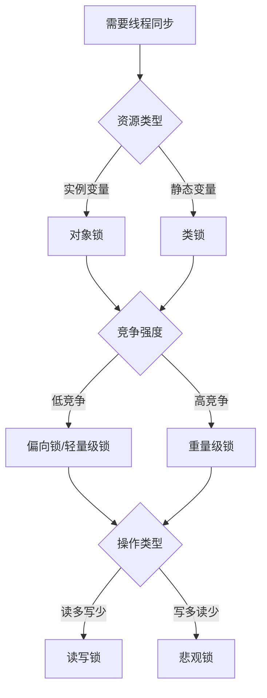

# 📘《Java 多线程编程实战与优化》教材大纲

---

## 第一章：多线程基础回顾

- 1.1 并发与并行的区别
- 1.2 线程与进程概念
- 1.3 Java 中的线程模型简述
- 1.4 `Thread` 与 `Runnable` 的实现方式
- 1.5 `Thread` 生命周期与状态转换图
```sql
  NEW → RUNNABLE → RUNNING → (WAITING/BLOCKED) → RUNNABLE → TERMINATED
  可通过 Thread.getState() 获取当前线程状态。
  NEW：新建状态，线程对象已创建但未调用 start()
  RUNNABLE：可运行状态，已准备好等待 CPU 调度
  BLOCKED：阻塞状态，等待获取某个锁
  WAITING/TIMED_WAITING：主动进入等待或限时等待
  TERMINATED：线程已终止
```
- 1.6 `Thread` 与 `Runnable` 实现方式的核心区别

| 比较维度       | 继承 `Thread`                        | 实现 `Runnable`                           |
|----------------|--------------------------------------|--------------------------------------------|
| 类的继承限制   | 已继承 `Thread`，不能再继承其他类    | 只实现接口，可继承其他类（更灵活）        |
| 职责分离       | 线程逻辑和线程控制耦合在一起         | 任务逻辑与线程分离，更清晰、可复用         |
| 多线程共享资源 | 不方便共享资源                      | 可多个线程共享同一个 `Runnable` 实例中的资源 |
| 资源消耗       | 每次都创建一个新线程对象              | 可以复用线程对象，配合线程池更高效         |
| 推荐程度       | 一般用于简单场景                     | 推荐使用方式，适合生产环境                 |

> ✅ 结论：**推荐优先使用 `Runnable` 实现方式**，具有更强的扩展性、资源复用能力，便于和线程池整合。
- 1.7 什么时候适合使用线程池（ThreadPoolExecutor）

| 场景类型         | 是否适合使用线程池 | 说明                                                                 |
|------------------|--------------------|----------------------------------------------------------------------|
| 任务频繁且数量大 | ✅ 适合             | 可避免频繁创建销毁线程带来的性能开销                                |
| 任务执行时间短   | ✅ 适合             | 可快速复用线程资源，提高系统吞吐量                                  |
| 控制并发数量     | ✅ 适合             | 通过核心线程数和最大线程数限制系统并发量                            |
| 系统对性能敏感   | ✅ 适合             | 提高 CPU 利用率，避免资源浪费                                       |
| 多线程任务独立   | ✅ 适合             | 每个任务之间无共享状态，线程池处理更高效                            |
| 资源有限需防止 OOM | ✅ 适合           | 通过有界队列与拒绝策略防止过度创建线程导致内存溢出                 |
| 临时、一次性任务 | ❌ 不适合           | 直接使用 `new Thread()` 创建更简洁，线程池配置反而是负担             |
| 每个线程需独占资源 | ❌ 不适合         | 线程池复用线程会导致资源冲突，应按需创建线程                         |
| 不确定任务量且不可控 | ⚠️ 慎用        | 如果任务激增，线程池可能堆积任务导致系统资源被耗尽，应合理配置参数 |

> ✅ **推荐实践**：使用 `ThreadPoolExecutor` 显式构造线程池，并合理设置核心线程数、最大线程数、队列大小和拒绝策略。


---

## 第二章：Java 内置的线程控制机制
### 2.1 线程启动、挂起、恢复、终止
- **启动**：通过 `Thread.start()` 调用 `run()` 方法（本质是JVM调用`start0()`本地方法）
- **挂起/恢复**（已废弃）：
  - ~~`Thread.suspend()`~~（易导致死锁）
  - ~~`Thread.resume()`~~
  - 替代方案：通过 `wait()`/`notify()` 机制实现
- **终止**（已废弃）：
  - ~~`Thread.stop()`~~（会导致对象状态不一致）
  - 推荐方案：使用中断标志位 + `Thread.interrupt()`

### 2.2 synchronized 锁机制详解
```java
// 三种使用方式
public synchronized void method() {}  // 实例锁
public static synchronized void method() {} // 类锁
synchronized(obj) { ... } // 自定义对象锁
```
- **实现原理**：基于对象头的Mark Word和Monitor（管程）机制
- **锁竞争**：
    - 当线程进入同步块时，会尝试通过CAS获取Monitor的_owner字段
    - 失败后进入ContentionList（竞争队列）

---

### 2.3 Java 锁的完整分类与对比
#### 按锁的实现层级分类
| 类型        | 作用范围               | 实现方式                            | 典型场景                 |
|-----------|--------------------|---------------------------------|----------------------|
| **对象锁**   | 实例方法/代码块          | `synchronized(this)` 或实例同步方法     | 保护实例变量（如用户订单状态）    |
| **类锁**    | 静态方法/Class对象      | `synchronized(MyClass.class)` 或静态同步方法 | 保护静态资源（如全局计数器）      |

#### 按锁的设计特性分类
| 类型             | 特性                                                                 | 实现类                     |
|----------------|--------------------------------------------------------------------|-------------------------|
| **悲观锁**        | 假定并发冲突必然发生，先加锁再操作                                         | `synchronized`, `ReentrantLock` |
| **乐观锁**        | 假定无冲突，通过版本号/CAS检测冲突                                        | `AtomicInteger`, `StampedLock` |
| **可重入锁**       | 同一线程可重复获取已持有的锁                                              | `ReentrantLock`, `synchronized` |
| **公平锁 vs 非公平锁** | 公平锁按请求顺序分配锁；非公平锁允许插队（`synchronized`为非公平锁）                     | `ReentrantLock(true/false)` |

---

### 2.4 锁升级与可重入性
#### 锁状态变迁（JVM优化）
1. **无锁**：新对象初始状态
2. **偏向锁**：通过对象头存储线程ID（单线程优化）
3. **轻量级锁**：CAS自旋尝试获取（低竞争多线程）
4. **重量级锁**：操作系统互斥量（Mutex）实现阻塞（高竞争）

#### 可重入性实现
- **计数器机制**：每次重入锁计数器+1，释放时-1，归零后完全释放锁
```java
public synchronized void methodA() { 
    methodB(); // 可重入锁允许调用其他同步方法
}
public synchronized void methodB() {} 
```

---

### 2.5 volatile 关键字原理
```java
private volatile int count;
```
- **内存屏障**：
    - 写操作后插入`StoreStore` + `StoreLoad`屏障（强制刷新主内存）
    - 读操作前插入`LoadLoad` + `LoadStore`屏障（禁止使用缓存）
- **禁止重排序**：通过内存屏障保证指令顺序性
- **局限性**：不保证复合操作的原子性（如`i++`）

---

### 2.6 并发三特性与实现机制
| 特性         | 定义                          | 实现手段                                                                 |
|------------|-----------------------------|----------------------------------------------------------------------|
| **可见性**    | 线程修改对其它线程立即可见                | `volatile`、`synchronized`、`final`（通过内存屏障或锁的happens-before规则） |
| **有序性**    | 程序按代码顺序执行                    | `volatile`、`synchronized`（内存屏障）、`happens-before`原则               |
| **原子性**    | 操作不可分割                       | `synchronized`、`Lock`、`CAS`（如`AtomicInteger`）                     |

---

### 附：锁选择决策流程图


> **关键总结**
> 1. 优先使用`ReentrantLock`实现超时锁等待（`tryLock()`）
> 2. 单例模式需用`volatile`+双重检测避免指令重排序问题
> 3. 锁粗化（合并同步块）和锁消除（JIT优化）可提升性能
> 4. `ThreadLocal`是避免锁竞争的替代方案（线程封闭）
```


## 第三章：并发工具类详解（java.util.concurrent）
### 3.1 Executor 框架详解（线程池原理）

- **核心接口层次**  
  - `Executor`：最基础接口，仅定义 `execute(Runnable)`；  
  - `ExecutorService`：扩展接口，支持 `submit`、`invokeAll`、生命周期管理；  
  - `ThreadPoolExecutor`：线程池核心实现，可精细配置；  
  - `Executors`：工厂类，提供快捷线程池实现（生产环境慎用）。

- **执行流程**  
  1. 调用 `execute`/`submit` 提交任务；  
  2. 若运行线程数 < `corePoolSize`，新建核心线程执行；  
  3. 否则，任务入 `workQueue`；  
  4. 若队列已满且线程数 < `maximumPoolSize`，新建非核心线程；  
  5. 若仍无法入队且线程数已到上限，触发拒绝策略。

---

### 3.2 线程池配置与优化策略

#### 3.2.1 核心线程数 与 最大线程数

- **`corePoolSize`**  
  - CPU 密集型：`CPU 核心数 + 1`；  
  - I/O 密集型：`2 × CPU 核心数`。  

- **`maximumPoolSize`**  
  - 用于应对短时高并发。  
  - 设置过高易导致资源耗尽；过低易触发拒绝。

#### 3.2.2 阻塞队列 选择

| 队列类型                  | 特性                             | 适用场景                           |
|---------------------------|----------------------------------|------------------------------------|
| `LinkedBlockingQueue`     | 可选无界（默认）或有界；吞吐高     | 对延迟不敏感、大量任务积压         |
| `ArrayBlockingQueue`      | 固定容量；支持公平/非公平         | 容量可控、延迟敏感场景             |
| `SynchronousQueue`        | 容量为 0；直接交付                | `newCachedThreadPool()`，快速扩缩容 |
| `PriorityBlockingQueue`   | 支持优先级排序                    | 需优先级调度的任务                 |
| `DelayQueue`、`LinkedTransferQueue` 等 | 专用场景（定时、传输）      | 定时任务或生产/消费传输            |

#### 3.2.3 拒绝策略（`RejectedExecutionHandler`）

- **内置策略**  
  - `AbortPolicy`：抛出异常；  
  - `CallerRunsPolicy`：由调用者线程执行；  
  - `DiscardPolicy`：丢弃当前任务；  
  - `DiscardOldestPolicy`：丢弃队列最老任务。  
- **自定义**：可记录日志、报警或降级处理。

#### 3.2.4 存活时间 与 核心线程回收

- **`keepAliveTime`**：非核心线程空闲超时后被回收。  
- **`allowCoreThreadTimeOut(true)`**：开启后，核心线程亦可超时销毁。  
- **调优**：  
  - 瞬时高峰：低超时，及时释放资源；  
  - 稳定负载：适当延长，减少频繁销毁/重建。

#### 3.2.5 综合调优流程

1. **评估业务特性**：CPU/IO 比重、并发峰值、持续时间；  
2. **初始参数设定**：`core`、`max`、`queue`；  
3. **压测与监控**：关注 `ActiveCount`、`QueueSize`、`RejectedCount`；  
4. **动态调整**：通过 JMX 或 Spring 的 `ThreadPoolTaskExecutor`；  
5. **拒绝 & 降级**：即时处理拒绝，避免服务雪崩。

---

### 3.3 Future 与 Callable 使用

#### 3.3.1 Runnable vs. Callable

- **`Runnable`**：无返回值，不抛受检异常。  
- **`Callable<V>`**：支持返回值与异常；适合需获取结果的任务。

#### 3.3.2 Future 接口

- **获取结果**  
  ```java
  Future<V> future = executor.submit(callable);
  V result = future.get();              // 阻塞
  V result2 = future.get(1, TimeUnit.SECONDS); // 带超时
  ```
- **状态查询**：`isDone()`、`isCancelled()`
- **取消任务**：`cancel(true)`（可中断）或 `cancel(false)`

#### 3.3.3 FutureTask 进阶

```java
FutureTask<String> ft = new FutureTask<>(() -> heavyCompute());
executor.execute(ft);
// …
// 复用或缓存
String res = ft.get();
```
- **用法**
    - **缓存**：同一请求复用同一 `FutureTask`；
    - **预加载**：启动时异步计算、提前初始化资源。

#### 3.3.4 异常与取消最佳实践

1. **捕获 ExecutionException**
   ```java
   try { future.get(); }
   catch (ExecutionException e) {
     Throwable cause = e.getCause();
   }
   ```
2. **超时获取**：防止长时阻塞；
3. **任务中断**：在任务体内定期检查 `Thread.interrupted()`。

#### 3.3.5 CompletableFuture 简介

- Java 8 提供，支持：
    - 链式异步 (`thenApply`、`thenCompose`)；
    - 异常处理 (`exceptionally`)；
    - 与自定义线程池结合使用。

---

### 3.4 并发控制器

- **CountDownLatch**
  ```java
  CountDownLatch latch = new CountDownLatch(n);
  // 子线程执行完调用 latch.countDown();
  // 主线程 await 等待
  ```
- **CyclicBarrier**
  ```java
  CyclicBarrier barrier = new CyclicBarrier(n, () -> { /* 汇总逻辑 */ });
  // 各线程 barrier.await();
  ```
- **Semaphore**
  ```java
  Semaphore sem = new Semaphore(permits);
  sem.acquire();
  // 访问受限资源
  sem.release();
  ```

---

### 3.5 高级锁

- **ReentrantLock**
  ```java
  ReentrantLock lock = new ReentrantLock(true); // 公平锁
  lock.lockInterruptibly();
  try { /* 临界区 */ }
  finally { lock.unlock(); }
  ```
- **ReadWriteLock**
  ```java
  ReadWriteLock rw = new ReentrantReadWriteLock();
  rw.readLock().lock();
  // 多读并行
  rw.writeLock().lock();
  // 独占写
  ```
- **Condition**（替代 `wait/notify`）
  ```java
  Condition cond = lock.newCondition();
  cond.await();     // 释放锁并等待
  cond.signalAll(); // 唤醒等待线程
  ```

---

### 3.6 ThreadLocal 与 InheritableThreadLocal

- **ThreadLocal**
  ```java
  ThreadLocal<Conn> tl = ThreadLocal.withInitial(() -> createConn());
  Conn c = tl.get();
  ```
    - 场景：线程隔离的连接、上下文信息、线程安全的格式化等；
    - 陷阱：线程池中不调用 `remove()` 易导致内存泄漏。

- **InheritableThreadLocal**
    - 子线程继承父线程变量初始值；
    - 在线程池中无效，因线程复用，不推荐用于跨线程传递。

---

> **提示**：如需源码剖析、性能测试脚本或实战案例，可进一步交流！
---

## 第四章：J.U.C 并发容器与并发集合

- 4.1 `ConcurrentHashMap` 内部结构演进（JDK7 vs JDK8）
- 4.2 `CopyOnWriteArrayList`, `ConcurrentLinkedQueue`, `BlockingQueue`
- 4.3 多线程安全集合适用场景分析

---

## 第五章：原子类与无锁编程

- 5.1 `AtomicInteger`, `AtomicReference` 等原子类原理
- 5.2 CAS 与 ABA 问题
- 5.3 Unsafe 类简介
- 5.4 LongAdder 与性能优化

---

## 第六章：多线程设计模式与实践

- 6.1 生产者-消费者模式（阻塞队列 vs 显式锁）
- 6.2 线程池化模式（ThreadPoolExecutor 自定义实现）
- 6.3 工作窃取模式（ForkJoinPool）
- 6.4 Actor 模式简介（Akka 与异步消息）
- 6.5 Future 模式、观察者模式在并发中的应用

---

## 第七章：异步编程与响应式编程初探

- 7.1 Java CompletableFuture 深入讲解
- 7.2 `CompletionStage` 接口链式组合
- 7.3 Spring 异步支持（@Async）
- 7.4 简介 Reactor 与 RxJava

---

## 第八章：并发程序的调试与性能分析

- 8.1 死锁分析与检测（jstack, jconsole, visualvm）
- 8.2 线程状态监控与诊断
- 8.3 锁竞争与资源争用分析
- 8.4 性能分析工具：JMH、perf、arthas
- 8.5 实践：使用 JMH 对比 `synchronized` 和 `ReentrantLock`

---

## 第九章：高并发架构中的多线程应用案例

- 9.1 电商下单并发处理架构设计
- 9.2 秒杀系统中的并发控制策略
- 9.3 日志系统中的异步写入实现
- 9.4 分布式任务调度中的线程池设计
- 9.5 微服务网关中的并发控制点（限流、熔断、隔离）

---

## 第十章：高级主题与发展趋势

- 10.1 虚拟线程（Project Loom）初探
- 10.2 线程与协程比较（对标 Kotlin、Golang）
- 10.3 与操作系统线程模型的对比理解
- 10.4 并发模型的演进与未来方向
