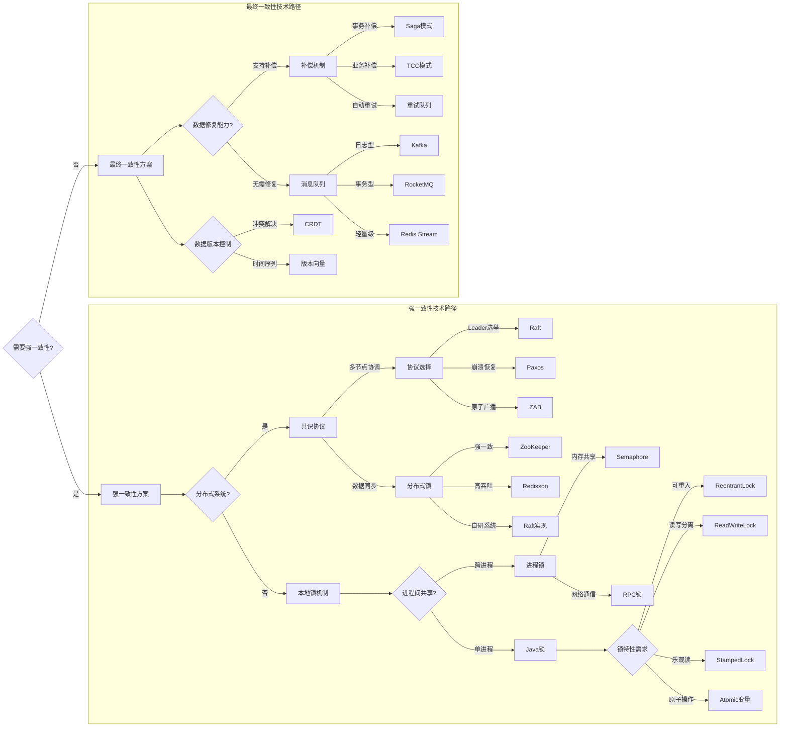

# 一致性模型与Java锁综合指南

## 一致性模型对比表（含业务场景与Java锁实现）
| 对比维度         | 强一致性 (Strong)                          | 最终一致性 (Eventual)                     |
|------------------|--------------------------------------------|--------------------------------------------|
| **数据时效性**   | 立即可见                                   | 延迟可见（秒级~分钟级）                    |
| **性能吞吐**     | 1k-5k TPS                                 | 50k-1M+ TPS                               |
| **实现复杂度**   | 2PC/Paxos/分布式锁                         | MQ/CRDT/版本向量                           |
| **业务场景**     | 银行转账/证券交易/库存扣减                  | 社交点赞/用户行为分析/日志聚合             |
| **Java锁实现**   | `ReentrantLock`/`synchronized`/`Redisson` | `StampedLock`/`ReadWriteLock`/`LongAdder` |
| **容错机制**     | 同步阻塞+事务回滚                          | 异步重试+补偿事务                          |
| **资源消耗**     | 高（CPU 30%-50%）                          | 低（CPU 5%-15%）                          |
---

## 全链路一致性决策图（含一致性要求）



```markdown
# Java 并发控制工具代码示例与应用场景

## 1. ReentrantLock
**代码示例：**
```java
import java.util.concurrent.locks.ReentrantLock;

public class Counter {
    private final ReentrantLock lock = new ReentrantLock();
    private int count = 0;

    public void increment() {
        lock.lock();
        try {
            count++;
        } finally {
            lock.unlock();
        }
    }
    
    public int getCount() {
        lock.lock();
        try {
            return count;
        } finally {
            lock.unlock();
        }
    }
}
```

**应用场景：**
- 需要可中断的锁获取操作
- 需要尝试获取锁（`tryLock`）
- 公平锁机制（`new ReentrantLock(true)`）
- 绑定多个`Condition`的条件队列

---

## 2. ReadWriteLock
**代码示例：**
```java
import java.util.concurrent.locks.ReentrantReadWriteLock;
import java.util.HashMap;
import java.util.Map;

public class DataCache {
    private final ReentrantReadWriteLock rwLock = new ReentrantReadWriteLock();
    private Map<String, Object> cache = new HashMap<>();

    public Object get(String key) {
        rwLock.readLock().lock();
        try {
            return cache.get(key);
        } finally {
            rwLock.readLock().unlock();
        }
    }

    public void put(String key, Object value) {
        rwLock.writeLock().lock();
        try {
            cache.put(key, value);
        } finally {
            rwLock.writeLock().unlock();
        }
    }
}
```

**应用场景：**
- 读多写少的缓存系统
- 资源访问统计（如网站访问计数器）
- 数据库连接池管理
- 需要读写分离的数据结构

---

## 3. StampedLock
**代码示例：**
```java
import java.util.concurrent.locks.StampedLock;

public class Point {
    private double x, y;
    private final StampedLock sl = new StampedLock();

    void move(double deltaX, double deltaY) {
        long stamp = sl.writeLock();
        try {
            x += deltaX;
            y += deltaY;
        } finally {
            sl.unlockWrite(stamp);
        }
    }

    double distanceFromOrigin() {
        long stamp = sl.tryOptimisticRead();
        double currentX = x, currentY = y;
        if (!sl.validate(stamp)) {
            stamp = sl.readLock();
            try {
                currentX = x;
                currentY = y;
            } finally {
                sl.unlockRead(stamp);
            }
        }
        return Math.sqrt(currentX * currentX + currentY * currentY);
    }
}
```

**应用场景：**
- 地理位置坐标系统
- 金融交易系统中的价格快照
- 实时数据统计监控
- 需要乐观读锁的高并发读场景

---

## 4. Atomic 类
**代码示例：**
```java
import java.util.concurrent.atomic.AtomicInteger;

public class AtomicCounter {
    private AtomicInteger count = new AtomicInteger(0);

    public void increment() {
        count.incrementAndGet();
    }

    public int getCount() {
        return count.get();
    }
    
    public boolean compareAndSet(int expect, int update) {
        return count.compareAndSet(expect, update);
    }
}
```

**应用场景：**
- 高性能计数器
- 状态标志管理（如服务状态切换）
- 无锁数据结构实现
- 并发环境下的ID生成器

---

## 5. Synchronized
**代码示例：**
```java
public class SynchronizedDemo {
    private int sharedValue = 0;
    
    // 同步方法
    public synchronized void safeIncrement() {
        sharedValue++;
    }
    
    // 同步代码块
    public void safeDecrement() {
        synchronized(this) {
            sharedValue--;
        }
    }
    
    // 静态同步方法
    public static synchronized void staticMethod() {
        // 类级别锁
    }
}
```

**应用场景：**
- 简单的线程安全计数器
- 单例模式实现（双重检查锁定）
- 保护简单共享资源访问
- 需要快速实现同步的原型开发

---
## 对比总结
| 机制            | 核心特点                  | 适用场景                     | 性能级别    |
|----------------|--------------------------|----------------------------|------------|
| `synchronized` | JVM内置，自动释放锁        | 简单同步需求                 | 中等        |
| `ReentrantLock`| 可中断/定时/公平锁         | 复杂锁控制需求               | 较高        |
| `ReadWriteLock`| 读写分离                  | 读多写少场景                 | 高（读操作）|
| `StampedLock`  | 乐观读锁                  | 极高读并发场景               | 最高        |
| `Atomic`       | CAS无锁操作               | 简单原子操作                 | 最高        |
```
---
