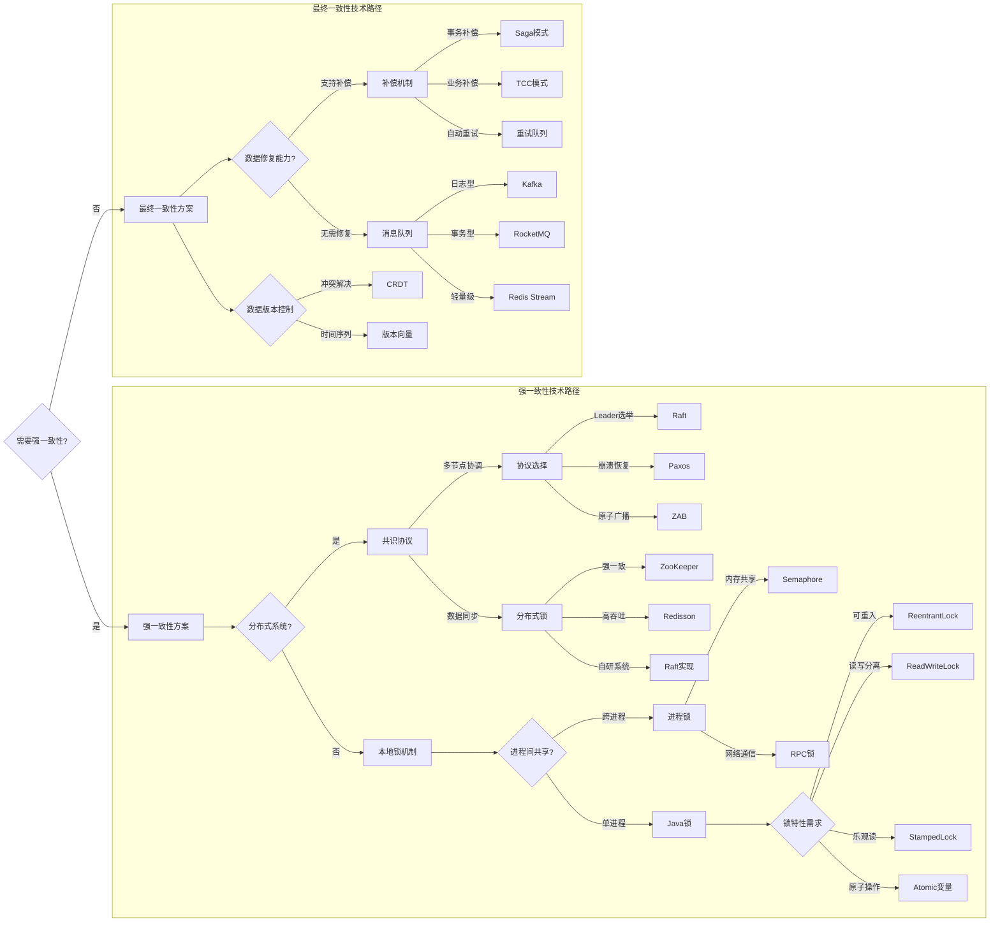

# 一致性模型与Java锁综合指南

## 一致性模型对比表（含业务场景与Java锁实现）
| 对比维度         | 强一致性 (Strong)                          | 最终一致性 (Eventual)                     |
|------------------|--------------------------------------------|--------------------------------------------|
| **数据时效性**   | 立即可见                                   | 延迟可见（秒级~分钟级）                    |
| **性能吞吐**     | 1k-5k TPS                                 | 50k-1M+ TPS                               |
| **实现复杂度**   | 2PC/Paxos/分布式锁                         | MQ/CRDT/版本向量                           |
| **业务场景**     | 银行转账/证券交易/库存扣减                  | 社交点赞/用户行为分析/日志聚合             |
| **Java锁实现**   | `ReentrantLock`/`synchronized`/`Redisson` | `StampedLock`/`ReadWriteLock`/`LongAdder` |
| **容错机制**     | 同步阻塞+事务回滚                          | 异步重试+补偿事务                          |
| **资源消耗**     | 高（CPU 30%-50%）                          | 低（CPU 5%-15%）                          |
---

## 全链路一致性决策图（含一致性要求）

